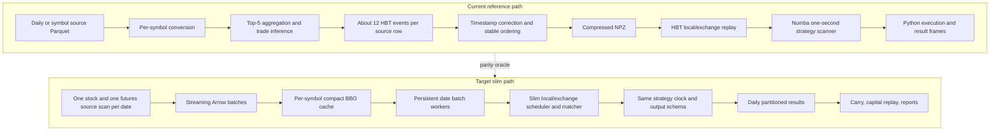

# HBT Acceleration Strategy

## Status and purpose

This document is the implementation plan for accelerating the Taiwan
futures/spot backtest without weakening market-data, execution, carry, capital,
or reporting semantics. It covers the full cold and warm paths:

1. Read the daily stock and stock-future source data.
2. Build a reusable, symbol-partitioned compact cache.
3. Replay many futures/spot pairs with an extracted matching kernel.
4. Persist daily results without retaining a year of detailed frames in RAM.
5. Preserve the existing HftBacktest engine as the behavioral reference.

The plan intentionally distinguishes measured facts, engineering targets, and
semantic changes. A speed target is not considered achieved until it is
measured on the same inputs, hardware, engine semantics, and output settings.

## Executive decision

Do not accelerate the system by deleting general-purpose HftBacktest source
code. Rust release builds already avoid much unused code in the hot path, and
HBT replay is a small part of the measured cold-run time.

Build two explicit engines instead:

- **Reference engine:** the installed `hftbacktest` package, existing event
  converter, Python engine, and Numba scanner. It remains the regression oracle,
  queue-model research engine, and custom-strategy fallback.
- **Slim engine:** a project-owned, domain-neutral Rust matching core with a
  futures/spot adapter. It consumes compact BBO data, preserves the required HBT
  time and order semantics, and emits the existing audit/output schema.

The main acceleration comes from eliminating repeated source reads, the
approximately twelve-to-one expansion from source snapshots to 64-byte HBT
events, compressed NPZ write/read work, repeated worker startup, and annual
in-memory result accumulation.

## Measured baseline

The retained March 2026 benchmark is the current planning baseline:

| Measure | Result |
| --- | ---: |
| Trading dates | 22 |
| Completed pair runs | 638 |
| Unique event assets | 1,276 |
| Source Top-5 rows | 98,798,131 |
| Expanded HBT events | 1,181,883,252 |
| Expansion ratio | 11.96 events per source row |
| Compressed HBT event files | 4.97 GB |
| Conversion wall time | 3,730 seconds |
| HBT wall time | 157 seconds |
| Daily-config build time | 136 seconds |
| Approximate cold total | 4,023 seconds / 67 minutes |

Conversion sub-timings were approximately 2,835 seconds loading source data,
145 seconds building events, 92 seconds normalizing them, and 629 seconds
writing compressed NPZ files. HBT replay accounted for only about 3.9% of the
cold total. Making HBT replay free while leaving conversion unchanged would
therefore improve the complete cold run by only about 1.04x.

The March pair universe also showed no repeated spot or futures symbol within a
trading date. Multi-pair batching must therefore earn its gains from persistent
workers, compact inputs, balanced scheduling, and reduced Python overhead, not
from assumed same-day symbol sharing.

Benchmark sources:

- `future_spot/output/runtime_benchmark_202603/hbt_result.json`
- `future_spot/output/runtime_benchmark_202603/conversion_result.json`
- `future_spot/output/runtime_benchmark_202603/conversion_details.log`

## Goals

### Correctness goals

- Preserve the requested date and pair universe, exclusions, conversion audit,
  errors, carry, expiry handling, fills, latency events, and capital candidates.
- Preserve the current one-second strategy decision clock unless a run
  explicitly configures a different `step_ms`.
- Preserve independent feed, order-entry, and response latency for both legs.
- Preserve deterministic ordering for equal-timestamp local feed, local order,
  exchange feed, and exchange order events.
- Make configured FOK and IOC behavior real and explicit. Never silently map an
  unsupported time-in-force to GTC.
- Keep legacy-GTC parity and intended-FOK/IOC results as separate baselines.
- Keep the reference HBT engine available after the slim engine is introduced.

### Performance goals

These are engineering targets, not guarantees:

| Scenario | Target |
| --- | ---: |
| First cold compact-cache build | 2-4x faster than current conversion |
| Warm compact-cache replay | 3-6x faster than expanded HBT NPZ replay |
| Complete monthly cold run | 4-7x faster after all phases |
| Compact source rows | One BBO row instead of about 12 HBT events |
| Peak annual-run memory | Bounded by a date/shard, not the number of dates |

### Non-goals

- Replacing HBT for passive GTC/GTX queue-model experiments.
- Reconstructing market-by-order or exact queue position from Top-5
  market-by-price data.
- Adding an implicit futures roll.
- Changing the no-partial-fill assumption or adding displayed-size partial
  fills as an optimization side effect.
- Removing audit rows, errors, exclusions, open positions, or capital
  constraints to make the run faster or cleaner.
- Building a generic live trading engine, connector framework, L3 book, or HBT
  statistics replacement.

## Current path and target path



## Compact cache design

### Physical format

Use Arrow IPC File / Feather V2 with LZ4 compression by default. Store one file
per date, source, and symbol:

```text
data/tw_compact_v1/
└── date=20260302/
    ├── source=stock/
    │   ├── 2330.arrow
    │   ├── 2317.arrow
    │   └── manifest.json
    └── source=stock_future/
        ├── CDFC6.arrow
        ├── DHFC6.arrow
        └── manifest.json
```

Reasons for Arrow IPC:

- Native columnar buffers and bounded RecordBatch reads.
- Efficient Python/Rust interchange.
- Memory-mapped file access for warm runs.
- Explicit schema and metadata versioning.
- LZ4 support for a practical read-speed/disk-space tradeoff.

Compressed Arrow buffers still require decompression and must not be described
as completely zero-copy. Uncompressed Arrow and ZSTD are benchmark variants,
not assumed defaults.

### BBO schema

The first schema version contains:

```text
source_seq    uint64
exch_ts       int64
local_ts_raw  int64
bid_px        float64
ask_px        float64
bid_qty       float64
ask_qty       float64
last_px       float64
total_volume  int64
```

Date, symbol, source kind, schema version, tick metadata, timestamp correction,
and source fingerprints belong in the file or directory manifest rather than
being repeated in every row.

Keep a separate `top5_v1` format only for workflows that need full Top-5 depth.
Do not silently substitute BBO data for passive-order or queue-model research.

### BBO construction semantics

Do not copy raw `bid_price1` and `ask_price1` without normalization. For every
source row:

1. Read levels 1 through 5.
2. Reject invalid or non-positive price/quantity entries.
3. Apply the configured volume scale or price-only placeholder behavior.
4. Aggregate quantities for repeated prices.
5. Sort distinct bids descending and asks ascending.
6. Save the first valid price and its aggregated quantity.

The existing aggregation logic in `scripts/tw_stock_data_to_npz.py` is the
reference. Refactor shared behavior rather than maintaining two subtly
different implementations. Preserve decimal prices, especially for ETFs.

### One-scan guarantee

For a successful cold build of one trade date:

- Scan the stock daily source once.
- Scan the stock-future daily source once.
- Project only required columns.
- Filter the date universe while streaming.
- Route each RecordBatch to per-symbol Arrow writers.
- Never call `scan_parquet` or an equivalent source read inside a symbol loop.
- Never let pair workers access raw daily Parquet paths.

This means two logical source scans per date, one for each market. If a daily
source is physically composed of several Parquet files, each underlying file
may be read once.

The builder must use a streaming batch iterator. Do not `collect()` an entire
multi-gigabyte all-symbol daily file into RAM. The current per-symbol DataAPI
and daily all-symbol materialization use different storage paths; the daily
path becomes authoritative only after the parity gate below passes.

### Per-symbol timestamp correction and ordering

The existing converter calculates negative-latency correction per converted
symbol. A single daily offset would change semantics. Store raw local timestamps
and per-symbol metadata such as:

```json
{
  "raw_min_feed_latency_ns": -12000,
  "local_timestamp_adjustment_ns": 12000,
  "base_latency_ns": 0,
  "exchange_ordered": true,
  "local_ordered": true,
  "requires_dual_order": false
}
```

Apply the adjustment at read/replay time. Preserve stable source order with
`source_seq`. When exchange or local time is not monotonic, save compact
exchange/local order-index sidecars or an equivalent deterministic ordering
representation. Do not assume source-row order is sufficient.

### Cache identity and publication

Each manifest must include all result-affecting cache inputs:

- Source paths, sizes, modification timestamps, Parquet metadata identity, and
  source row counts.
- Projected columns, requested symbols, session range, status filters, volume
  scale, price-only quantity behavior, and timezone.
- Schema and builder versions.
- Builder/source implementation fingerprint.
- Per-symbol rows, timestamp range, min/max price, latency adjustment, ordering
  flags, actual bytes, and validation status.
- `build_complete`, errors, and exclusions.

Do not perform an unrecorded second source scan merely to calculate a hash. If a
cryptographic source checksum is required, obtain it from upstream ingestion or
calculate it as part of the authorized single read. Otherwise record the same
conservative stat and Parquet-metadata identity used to validate the source.

Write temporary files inside the final cache filesystem and publish one date
atomically only after all expected partitions and the manifest validate. A
failed date must remain explicitly incomplete and must not be reused.

### Disk safety for annual builds

March's 98.8 million source rows imply approximately 7.1 GB of raw payload for
the nine-field BBO schema and about 9.5 GB with a conservative 96-byte-per-row
upper estimate. Twelve March-sized months are approximately 114 GB before the
additional safety factor. Actual LZ4 size must be measured, not assumed.

Before an annual build:

1. Read Parquet metadata for all requested source files.
2. Estimate `total_source_rows * 96 * 1.20` without relying on universe
   selectivity or compression.
3. Add existing cache bytes and the largest one-day temporary requirement.
4. Require the result to remain under both the configured cache budget and the
   filesystem free-space reserve.

Recommended initial controls:

```text
--compact-cache-compression lz4
--compact-cache-profile bbo
--compact-cache-max-gb 200
--compact-cache-min-free-gb 200
```

Check actual cache size and free space during every RecordBatch write. Exceeding
a budget stops the current date with an audited error. It must never trigger
unrequested deletion of existing data. Publish dates sequentially so atomic
builds require only one day of temporary space, not a duplicate annual cache.

### Daily-versus-symbol source parity gate

The current stock converter uses symbol-partitioned history and update stores;
the one-scan plan uses the separate all-symbol daily materialization. Do not
assume they are identical.

Compare canonical columns for normal, high-volume, decimal-priced, boundary,
and incomplete-date samples:

```text
symbol, exchtime, localtime, status, last_price, total_volume,
bid_price1..5, bid_volume1..5, ask_price1..5, ask_volume1..5
```

Require matching row counts, stable order, null positions, integer values, and
decimal prices. Record canonical per-symbol batch hashes. If parity fails, keep
the existing per-symbol source as authoritative and report the mismatch; do not
trade correctness for a single daily scan.

If the one-scan requirement must still be met after a parity failure, repair or
rebuild the upstream daily materialization from the authoritative ingestion
stream, then repeat the parity gate. Concatenating or rereading every
symbol-partitioned file is not a daily single scan and must not be reported as
one.

## Slim matching engine

### Extraction boundary

The slim kernel needs only:

- Two assets per pair and many independent pair states per date.
- Local and exchange market views.
- Independent feed, order-entry, and response latency per leg.
- A deterministic event scheduler.
- Limit order submit, FOK/IOC fill or expiry, response, and audited cancel
  compatibility.
- No-partial-fill execution at the opposite best price.
- Current timestamp, BBO/quantity, order state, and latency timestamps.
- The default futures/spot pricing and signal scanner, or an equivalent bounded
  callback that avoids per-row Python object construction.

Do not extract HBT live trading, collectors, connectors, L3, ROI/BTree depth,
partial-fill exchange, inverse assets, generic fee/state accounting, recorder,
statistics, historical latency interpolation, market orders, or order modify
unless a later strategy demonstrates a real need.

Place a domain-neutral Rust crate under a root-level `crates/` directory. Put
strategy-neutral Python bindings/adapters in root `scripts/`; put futures/spot
pricing, risk, position, output mapping, and CLI integration in
`future_spot/arbitrage/`. A new strategy must not depend on `future_spot` for
reusable matching behavior.

### Time-in-force correctness gate

The installed HFT package exposes only GTC and GTX at its top level while FOK
and IOC exist under `hftbacktest.order`. The current helper silently falls back
to GTC when a configured value is not found. Resolve this before using a slim
engine:

- Import or map GTC, GTX, FOK, and IOC explicitly.
- Raise on unknown time-in-force values.
- Bump result/cache manifest versions.
- Preserve a legacy-GTC fixture for historical parity.
- Establish a separate intended-FOK/IOC baseline for future results.

Never label a legacy fallback result as true FOK/IOC.

### Strategy clock

The current default evaluates at `step_ms`, normally one second, after HBT has
processed events through that time. A fused kernel must not evaluate on every
BBO update.

Maintain next timestamps for the strategy clock, both local feeds, both
exchange feeds, order requests, and order responses. Process internal events
through the next strategy timestamp, then evaluate once. Order-response waits,
post-first-feed waits, timeouts, and end-of-data behavior add explicit wakeups
without converting the entire strategy to event-by-event evaluation.

### Equal-timestamp priority

Match HBT's current event-set priority exactly. For two assets, use the
equivalent of:

```text
(timestamp, asset_no, event_kind_priority, source_seq)

LocalData  = 0
LocalOrder = 1
ExchData   = 2
ExchOrder  = 3
```

Changing tie order can change whether an order sees the old or new book. Golden
tests must place all event kinds at the same nanosecond and compare fill status,
price, and latency timestamps.

### Execution semantics

For the intended FOK/IOC no-partial-fill profile:

- A buy limit fills fully at the exchange best ask at arrival only when its
  limit tick is at or above that best ask; otherwise it expires.
- A sell limit fills fully at the exchange best bid at arrival only when its
  limit tick is at or below that best bid; otherwise it expires.
- Displayed size does not cap the fill under the existing no-partial-fill model.
- The second-leg condition is re-evaluated after the first response and the
  configured feed wait.
- Failed second-leg and timeout actions preserve the existing flatten audit and
  PnL handling.

Passive orders and queue models remain reference-engine-only until explicitly
specified and validated for the slim engine.

## Multi-pair and annual execution

### Date batch engine

A trading date contains many independent pair states:

```text
DateBatchEngine
├── PairState[0] = spot A + future A
├── PairState[1] = spot B + future B
└── PairState[N] = spot N + future N
```

Each pair owns its position, orders, latency configuration, signal state, and
carry input. Balance shards using the sum of the spot and futures compact-row
counts so a high-volume pair does not dominate one worker.

Do not claim same-symbol reuse unless a measured universe contains it. If reuse
does occur later, co-locating consumers in one shard is an optional improvement,
not a correctness requirement.

### Persistent worker pool

Create one process pool outside the date loop. For each date:

1. Build or validate the date's compact cache.
2. Construct date records, including carried positions and exact old contracts.
3. Submit balanced pair shards to the persistent workers.
4. Wait for all date work to complete.
5. Update carry and expiry state.
6. Persist and release date results.
7. Continue to the next date.

Never submit later dates before current-date carry is resolved. Persistent
workers remove repeated process startup and let Numba or native initialization
be reused without making dates concurrent.

### Daily result store

The current carry runner retains every date's pair results and detailed frames
until the end. This is unsafe for annual runs. Persist core results by date:

```text
output/core/
├── summary/trade_date=2026-03-02/part.parquet
├── trades/trade_date=2026-03-02/part.parquet
├── market/trade_date=2026-03-02/part.parquet
├── latency/trade_date=2026-03-02/part.parquet
├── entry_exit/trade_date=2026-03-02/part.parquet
└── daily_manifests/2026-03-02.json
```

At each date boundary:

- Build entry/exit output while pair results are still available.
- Advance carry before releasing the summary needed by carry logic.
- Write and validate date partitions.
- Retain only small summaries, carry state, errors, settings, and path indexes.
- Release pair results and detailed frames.

Generate compatibility CSVs and reports by streaming persisted date partitions.
The existing low-memory report readers are the model. `report-mode summary`
remains the annual default; diagnostic full output requires an explicit output
budget.

### Restart and cache behavior

Each completed date gets a manifest containing input/cache identity, pair run
keys, engine/version, result row counts, and carry-out identity. A restart may
reuse a completed prefix only when the manifests form a valid sequential carry
chain. Never skip a failed or incomplete date and silently continue carry.

## Hazards and controls

| Hazard | Control |
| --- | --- |
| FOK/IOC silently executes as GTC | Strict TIF mapping, errors on unknown values, separate semantic baselines |
| Annual detailed frames exhaust RAM | Persist and release each date; stream reports and compatibility CSVs |
| Slim engine evaluates every feed event | Explicit `step_ms` strategy clock and parity tests |
| Equal timestamps produce different fills | HBT-compatible priority key and golden collision tests |
| Daily global latency shift changes symbols | Raw local time plus per-symbol correction metadata |
| Source order is not monotonic | Stable source sequence and optional exchange/local order sidecars |
| Raw level 1 is not the true aggregated best | Reuse Top-5 aggregation logic before writing BBO |
| Daily source differs from symbol store | Mandatory canonical parity gate and fallback to current source |
| Daily `collect()` exceeds RAM | Streaming RecordBatch builder with projected columns |
| Worker/JIT startup repeats every date | One persistent pool with sequential date barriers |
| Cache fills the disk | Annual metadata preflight, hard cache budget, free-space reserve, per-batch checks |
| Atomic rebuild temporarily doubles a year | Publish one date at a time with same-filesystem temporary files |
| New engine invalidates stale results | Engine/schema/source fingerprints and conservative manifests |
| Fast path drops errors or exclusions | Same filtered records and persisted exclusion/error audit as reference path |
| Old futures position rolls implicitly | Carry exact contract identifiers; never substitute the new front month |

## Implementation phases

### Phase 0: correctness baselines

Deliverables:

- Strict TIF mapping with no silent fallback.
- Legacy-GTC and intended-FOK/IOC fixtures.
- Reference snapshots for clock, tie ordering, order latency, post-first-feed
  wait, end-of-data, second-leg failure, and flatten behavior.
- Benchmark command that records cold/warm cache, wall time, CPU time, peak RSS,
  input rows, bytes, and output rows.

Exit gate: all current reference tests pass, semantic changes are explicitly
versioned, and `run_errors.csv` remains clean or contains the same acknowledged
errors.

### Phase 1: annual result streaming

Deliverables:

- Daily partitioned result store.
- Daily entry/exit generation.
- Streaming compatibility CSV generation.
- Sequential restart manifests.
- Removal of annual `all_pair_results` and detailed-frame accumulation from the
  default path.

Exit gate: one-month and multi-month results match the reference outputs, while
peak RSS stays approximately date-bounded. A twelve-month test must not show
memory growth proportional to the number of dates.

### Phase 2: persistent workers

Deliverables:

- Executor lifetime moved outside the carry date loop.
- Date barriers and error cancellation preserved.
- Balanced pair shards based on compact/event row counts.
- Worker initialization/JIT count captured in benchmark output.

Exit gate: summaries, trades, latency, carry, and errors exactly match the
per-date executor path.

### Phase 3: compact cache

Deliverables:

- Daily-versus-symbol parity validator.
- Streaming daily builder.
- BBO Arrow schema, manifests, timestamp metadata, ordering sidecars, and disk
  budgets.
- Cold-build and warm-read benchmarks for uncompressed, LZ4, and ZSTD Arrow.
- Reference adapter capable of reconstructing equivalent inputs for parity
  testing without making the slim engine authoritative.

Exit gate: representative canonical data parity is exact, source scan count is
one per date/source on cold build and zero on warm reuse, and disk/RSS controls
operate under failure tests.

### Phase 4: slim Rust scheduler and matcher

Deliverables:

- Domain-neutral Rust crate and Python binding.
- Local/exchange BBO views, independent latency, deterministic scheduler, strict
  FOK/IOC limit matching, and audited fill/status output.
- Default futures/spot strategy adapter.
- `reference` and `slim` engine selection in CLI and manifest.

Exit gate: reference/slim golden comparisons pass for exact signal, order,
fill, latency, carry, error, and exclusion fields under the selected semantic
baseline.

### Phase 5: rollout and benchmarks

Run in this order:

1. One pair and one date.
2. Five pairs and one date.
3. One complete date.
4. One month.
5. Multiple months with carry.
6. One full year.

Do not make the slim engine the default until the one-month and multi-month
parity gates pass and its manifest/restart behavior has been exercised. Keep a
reference-engine canary after rollout.

## Test matrix

### Data and cache

- Decimal ETF prices remain decimal.
- Missing level 1, repeated prices, empty levels, null quantities, and crossed
  snapshots match the existing converter.
- Cold daily build scans each source once; warm build scans it zero times.
- Multiple pairs never cause raw daily Parquet reads in workers.
- Cache budget and free-space failures stop cleanly.
- Interrupted builds are never reused.
- Source or implementation changes invalidate the cache.

### Scheduler and execution

- Equal-timestamp local/exchange feed and order collisions.
- Positive, zero, and corrected negative feed latency.
- BBO movement during order-entry latency.
- Feed movement during response latency.
- Crossing and non-crossing buy/sell FOK and IOC.
- End of data before second leg or response.
- Post-first-feed wait modes and timeout.
- Second-leg profit-check failure and flatten action.
- No-partial-fill behavior independent of visible best quantity.

### Carry and reporting

- Exact-contract carry to the next date.
- No implicit front-month roll.
- Expiry residual policy and audit.
- Candidate, accepted, and capital-rejected entries remain separate.
- Daily persisted results reproduce aggregate reports.
- Restarted runs reproduce uninterrupted carry and results.
- Exclusions affect all stages consistently.

## Benchmark and reporting rules

- Compare engines only with the same date/pair universe, source identity,
  semantic baseline, latency, strategy settings, carry, reporting mode, worker
  count, and machine.
- Report cold cache build, warm cache reuse, replay, persistence, and report
  generation separately.
- Report wall time, CPU time, peak RSS, source/compact/event bytes, rows per
  second, pair runs, errors, and output rows.
- Include first-worker compilation or initialization in cold measurements and
  exclude it only in clearly labeled warm measurements.
- Use medians and at least three repetitions for short runs. Use one complete
  run plus stage timings for month/year runs.
- Never claim the 4-7x complete-run target until a matching benchmark reaches
  it. Preserve slower but more accurate results rather than tuning semantics to
  reach a target.

## Definition of done

The acceleration strategy is complete only when:

- A full-year run completes within configured disk and memory budgets.
- Dates remain sequential under carry and pairs remain parallel within dates.
- Daily source scans are bounded and audited as designed.
- Results persist incrementally and can restart from a verified prefix.
- The intended FOK/IOC semantics are explicit and tested.
- Reference and slim outputs meet the approved parity policy.
- Exclusions, errors, carry residuals, latency, and capital constraints remain
  fully auditable.
- The manifest identifies the engine, compact schema, source data, strategy,
  matching implementation, and result-defining settings.
- The reference HBT path remains runnable for regression and unsupported slim
  features.
