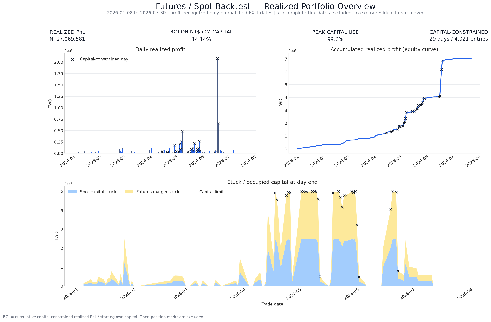

# 臺灣市場微結構回測

本專案以 [`hftbacktest`](https://github.com/nkaz001/hftbacktest) 為基礎，提供臺灣
股票、ETF、零股與股票期貨市場資料的研究工具。專案可將臺灣五檔
market-by-price 行情轉換為 HftBacktest events，提供精簡的跨策略 API，並實作包含
延遲、部位留倉、資金重播及報表的全市場股票期貨／現貨套利流程。

主要研究路徑是 `future_spot/`。根目錄下的 notebooks 仍可用於轉換結果檢查、
queue model 實驗及新策略原型開發。

## 回測結果

目前保留的最新投資組合報告涵蓋指定區間 **2026-01-01 至 2026-07-31**。圖表中
認列損益的日期為 **2026-01-08 至 2026-07-30**，因為只有雙腿完成配對出場時才
會認列損益。

| 指標 | 結果 |
| --- | ---: |
| 已實現損益 | NT$7,069,581.38 |
| NT$50M 初始資金的 ROI | 14.14% |
| 最高資金占用 | NT$49,779,287.42（99.56%） |
| 候選／接受進場 | 8,206 / 4,185（51.00%） |
| 因資金不足遭拒的進場 | 4,021 筆，共 29 天 |
| 接受出場 | 4,179 |



這是模擬研究結果，不代表實盤績效。資金重播共用 NT$50M，並停用槓桿：現貨與
期貨皆按名目金額的 100% 計入資金占用，且各自上限為 NT$25M；未納入未平倉部位
的市值評價。結果排除七個 tick 資料不完整的日期與八個到期殘留部位配對回測；
資金重播另外移除六個到期殘留部位。此次執行也記錄了 2026-07-10 的兩筆 event
data 缺漏錯誤。精確的輸入、排除項目、延遲設定與程式碼指紋都保存在
該次執行的 `backtest_manifest.json`。

來源輸出位於：

```text
future_spot/output/hbt_daily_full_market_20260101_20260731_future_order_1ms_response_1ms_feed_0ms_spot_order_1ms_response_35ms_feed_0ms/
```

## 快速開始

使用 Python 3.11 以上版本，並在專案根目錄安裝共用研究套件：

```bash
python3 -m pip install -r requirements.txt
```

執行全市場工作前，先跑一個小型單行程 smoke test：

```bash
python3 future_spot/test/run_full_backtest.py \
  --start-date 2026-05-21 \
  --end-date 2026-05-21 \
  --workers 1 \
  --max-pairs 5
```

由於 `--engine` 預設為 `reference`，上述指令會使用 reference engine。

### Slim engine

Slim engine 是專案自行維護的 Rust scheduler 與 matcher，適用於受限的期現貨 BBO
路徑。先建置 shared library，再以 `--engine slim` 明確選用：

```bash
cargo build --workspace --release

python3 future_spot/test/run_full_backtest.py \
  --engine slim \
  --start-date 2026-05-21 \
  --end-date 2026-05-21 \
  --workers 1 \
  --max-pairs 5 \
  --compact-cache-root data/tw_compact_v1
```

`--engine slim` 會自動選用 `--market-data-cache compact`。首次處理某個日期時，
runner 會以串流方式將所需的股票與期貨每日資料來源寫成具版本控制、依商品分割的
Arrow IPC 檔案；後續執行只有在 manifest 與來源 identity 驗證通過後，才會重用
該日期的 cache。預設使用 LZ4 壓縮。Cache builder 預設容量上限為 200 GB，並保留
至少 200 GB 可用空間；請依執行環境明確設定 `--compact-cache-max-gb` 與
`--compact-cache-min-free-gb`。只有刻意進行 cold rebuild 時才使用
`--rebuild-compact-cache`。

Slim 會保留設定的 `step_ms` 策略決策時鐘、各腿獨立的 feed/order/response latency、
第二腿條件重驗、部位留倉及結果稽核。其 matching contract 刻意限制如下：

- 每組 pair 固定為兩項資產：現貨與期貨；
- 僅支援立即穿價 BBO、且 time in force 必須嚴格為 FOK 或 IOC；
- 不允許 partial fill；未穿價訂單會到期，顯示的 BBO 數量不會限制成交量；
- 不支援被動 GTC/GTX、queue position、depth-sensitive 或任意 custom strategy
  行為。

不支援的模式應使用 reference engine；reference engine 同時也是 regression oracle。
在 reference 路徑中，`--strategy-engine numba` 是預設 scanner，
`--strategy-engine python` 則供除錯或 custom strategy 使用。Slim 使用共用的 Python
策略迴圈，而 scheduling、latency、市場狀態與 matching 由 Rust core 執行。

#### Slim engine 實作位置

| 路徑 | Slim engine 職責 |
| --- | --- |
| `crates/hbt_slim/src/lib.rs` | Rust scheduler、BBO state、latency/order state，以及立即 FOK/IOC matching core。 |
| `scripts/slim_engine.py` | `ctypes` binding、Arrow partition 載入，以及與 HBT 相容的 Python facade。 |
| `scripts/compact_cache.py` | 版本化 compact schema、具資源上限的每日建置、驗證與原子發布。 |
| `future_spot/arbitrage/hbt_backtest.py` | Engine 選擇與 pair strategy 整合。 |
| `future_spot/arbitrage/full_market_runner.py` | CLI、compact data 編排、依日期循序留倉、workers、結果持久化與 manifests。 |

Linux 環境會產生 `target/release/libhbt_slim.so`。Compact cache 的預設位置為
`data/tw_compact_v1/date=YYYYMMDD/source={stock|stock_future}/<symbol>.arrow`。

目前保留的一月至七月回測，除日期區間與資料路徑外，另使用以下會影響結果的執行與
資金設定：

```bash
python3 future_spot/test/run_full_backtest.py \
  --start-date 2026-01-01 \
  --end-date 2026-07-31 \
  --future-order-latency-ms 1 \
  --future-response-latency-ms 1 \
  --future-feed-latency-offset-ms 0 \
  --spot-order-latency-ms 1 \
  --spot-response-latency-ms 35 \
  --spot-feed-latency-offset-ms 0 \
  --post-first-feed-wait spot \
  --post-first-feed-timeout-ms 5000 \
  --no-leverage
```

預設資料路徑指向 Linux/WSL 的 `/mnt/z` 掛載點。若儲存配置不同，請提供
`--futures-parquet-template`、TWSE/TPEX 每日資料 templates，以及
`--data-platform-base` 參數。完整指令與 runner 控制項請參閱
[`future_spot/README.md`](future_spot/README.md)。

## 專案結構

| 路徑 | 職責 |
| --- | --- |
| `scripts/strategy_api.py` | 專案共用的 `StrategyContext`、`StrategyDecision`、`Strategy` 與 runner contracts。 |
| `scripts/hbt_types.py` | 與策略無關的 HBT asset 與 fill dataclasses。 |
| `scripts/hbt_common.py` | 共用的 queue、order、latency 與 fill helpers。 |
| `scripts/io_utils.py` | 小型 DataFrame、CSV 與時間處理 helpers。 |
| `scripts/compact_cache.py` | 可重用的 compact BBO cache schema、builder、manifest 與驗證。 |
| `scripts/slim_engine.py` | Rust slim engine 的 Python binding 與 HBT-compatible facade。 |
| `scripts/tw_stock_data_to_npz.py` | 將臺灣五檔資料列轉成 HftBacktest event arrays 或 `.npz`。 |
| `scripts/tw_stock_hftbacktest.py` | 共用的股票回測設定、asset 建立、狀態與 BBO helpers。 |
| `scripts/tw_stock_strategies.py` | 股票 notebook strategies 與 DataFrame summaries。 |
| `crates/hbt_slim/` | 專案自行維護的 Rust slim scheduler 與 matcher。 |
| `future_spot/arbitrage/` | 期現貨定價、風險、執行、HBT、留倉、資金與報表實作。 |
| `future_spot/scripts/` | 精簡的期現貨 CLI entrypoints。 |
| `future_spot/test/run_full_backtest.py` | 完整回測、報表資料表與 PNG 產生流程。 |
| `notebooks/` | 精簡的實驗 runners 與跨策略整合範例。 |

跨策略行為應放在根目錄的 `scripts/`。策略資料夾只負責自身領域模型、定價、風險、
執行、設定與輸出 schema。新的策略家族應實作 `scripts.strategy_api`，不應從
`future_spot` 匯入可重用行為。詳見
[`STRATEGY_GUIDANCE.md`](STRATEGY_GUIDANCE.md) 與
[`notebooks/hbt_strategy_interface_example.ipynb`](notebooks/hbt_strategy_interface_example.ipynb).

## 期現貨流程

全市場 runner 會執行以下可重現流程：

1. 選擇交易日期，建立符合資格的股票期貨／現貨 universe。
2. 建置或驗證選定的市場資料表示：legacy reference 路徑使用 HftBacktest event
   files，或使用依商品分割的 compact BBO Arrow files。
3. 使用指定 engine 重播每組 pair，且各腿有獨立的 feed、order 與 response latency。
4. 將未平倉部位帶到下一交易日，不會暗中轉倉期貨合約。
5. 依同一份共用資金預算重播已儲存的 fills。
6. 寫出稽核 CSV、報表資料表與 PNG 圖表。

預設策略在設定的 basis、effective tick 與 visible size 條件成立時，建立現貨多單／
期貨空單。預設先送出期貨腿；第一腿成交後會重新檢查第二腿條件。保留的回測會先
等待新的現貨 feed，再決定是否執行第二腿。若第二腿失敗，設定的風險處置會嘗試
平掉第一腿。

Reference execution engine 是預設值，其 Numba strategy scanner 為預設的最佳化實作；
需要除錯或 custom strategy 時可使用 `--strategy-engine python`。受限的 Rust 路徑須
以 `--engine slim` 明確選擇。Pair processes 可平行執行；啟用部位留倉時，日期仍會
循序處理。當會影響結果的參數、每日設定、market-data partitions 或 strategy/engine
原始碼變更時，`backtest_manifest.json` 會阻止重用既有 cache 結果。

### 重要輸出

每次完整執行都會在輸出目錄寫入以下檔案：

- `summary_all_daily_pairs.csv`：pair／日期狀態、部位及已實現損益。
- `trades_all_daily_pairs.csv`：委託與執行 events。
- `entry_exit_all_daily_pairs.csv`：精簡的訊號／執行稽核。
- `market_all_daily_pairs.csv`：取樣市場狀態與非 HOLD 訊號狀態。
- `latency_all_daily_pairs.csv`：local、spot-exchange 與 futures-exchange 時序 events。
- `position_carry_status.csv`：期初／期末部位、到期狀態與次日留倉狀態。
- `run_errors.csv`：pair 失敗或輸入缺漏；每次執行都必須檢查。
- `reports/`：資金、ROI、失敗、延遲與獲利資料表。
- `figures/`：投資組合、績效、延遲與資金圖表。

若要縮小報表占用空間，可使用 `--report-mode summary` 與
`--skip-entry-exit-by-pair`。明細資料表預設使用 Parquet；只有需要逐 event 失敗資訊
與資金診斷時才使用 `--report-mode full`。

## Event 轉換與市場資料限制

資料供應商的原始資料列不是合法的 HftBacktest 輸入，必須先轉成包含下列欄位的
event array：

```text
ev, exch_ts, local_ts, px, qty, order_id, ival, fval
```

股票轉換必須使用 `data_platform_client/data_stock/api`。舊的
`data_platform/data_stock/api` 路徑曾將所有欄位強制轉成 `Int64`，導致 ETF 小數價格
遭截斷。對 tick size 為 `0.05` 的 `0050`，正常 events 應包含 `77.90`、`77.95`、
`78.00` 與 `78.05` 等價格。

臺灣五檔資料是 market-by-price，而不是 market-by-order：

- 送出 snapshot events 前，必須彙總相同價格的 levels；
- 無法還原個別委託及精確的 queue position；
- 因此 queue position 屬於模型假設；
- `level=5` 是第五個非空價格 level，不是同一價格上的第五筆委託；
- 若來源資料沒有成交方向，預設會依前一筆 BBO 推定。

ETF 與零股每日 Parquet feeds 具有五檔價格，但沒有五檔數量。Converter 預設填入
`price_only_depth_qty=1.0`，因此這類重播只能用於結構性的 BBO/depth 檢查，不能視為
可靠的 queue volume 模擬。

HftBacktest depth 使用整數 tick index 作為索引。查詢數量前須先轉換價格：

```python
price = 77.10
tick = round(price / 0.05)
qty = depth.ask_qty_at_tick(tick)
```

不可直接將 `77.10` 傳給 `ask_qty_at_tick`；此方法需要整數 tick（本例為 `1542`）。

## Notebook 實驗

Notebooks 刻意維持為精簡 runners：

- `hftbacktest_TWStock.ipynb`：股票轉換與三種 queue/fill sanity strategies。
- `hftbacktest_TWETF.ipynb`：ETF daily Parquet 重播。
- `hftbacktest_TWOddLot.ipynb`：零股 daily Parquet 重播。
- `hftbacktest_TWStockFuture.ipynb`：股票期貨 daily Parquet 重播。
- `hbt_strategy_interface_example.ipynb`：新策略家族的 adapter template。

可重用邏輯應放在 Python modules 中。Notebook 輸出應優先顯示精簡的 summary
DataFrames，並將明細 frames 保留在個別變數中。

## 驗證

執行聚焦的測試套件，並編譯所有保留的 Python entrypoints：

```bash
python3 -m pytest -q tests future_spot/test
python3 -m py_compile scripts/*.py future_spot/arbitrage/*.py future_spot/scripts/*.py future_spot/test/*.py
```

除錯 `ask5` 或 `bid5` 缺漏時，應同時確認來源／events 中不同價格 levels 的數量與
商品的實際 tick size。不可從已懷疑存在捨入或轉換錯誤的輸出反推 tick size。
