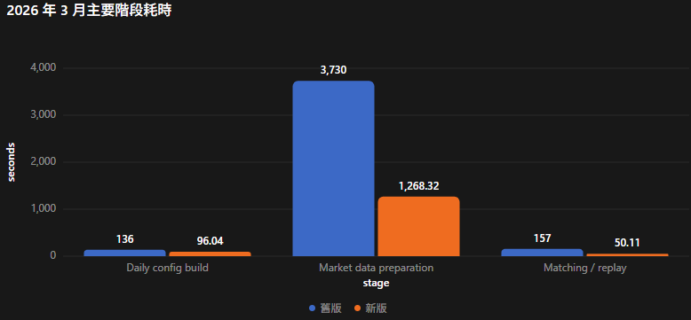

# 優化 Report

新版完整 2026 年 1–7 月 pipeline 為 11,712 秒，約 3 小時 15 分，執行 4,596 個 pairs。耗時主要分布為：
- 市場資料／compact cache：9,300 秒，79.4%
- Daily config build：574 秒，4.9%
- Identity validation：481 秒，4.1%
- Manifest write：461 秒，3.9%
- Pair matching：351 秒，3.0%       
- 其他輸出、audit、compatibility CSV：約 544 秒

> 純策略回測時間是 **Pair Matching** 351 秒

同口徑的 3 月 cold workload 約快 2.65×。 舊版約 4,023 秒（67.1 分鐘），新版約 1,520 秒（25.3 分鐘），減少約 62.2%，省下 41.7 分鐘。




# 優化方法

```
市場原始資料
│
├─ Arrow Compact Cache → 取代大量 HBT `.npz` event 檔
│  ├─ 每日來源資料只掃描一次
│  ├─ Top-5 正規化為 BBO
│  ├─ 依日期／市場／商品分區
│  └─ 降低資料轉換、讀取與儲存成本
│
├─ 回測引擎
│  ├─ Reference HftBacktest (原版) → 正確性比對、完整深度／queue model
│  └─ Slim Engine (輕量版) → 直接讀取 Arrow BBO、快速撮合
│
├─ Parallel Workers
│  ├─ 同日多個 pair 平行執行
│  ├─ 常駐 worker pool，避免每日重啟
│  └─ 依資料量平衡分配工作
│
└─ Daily Result Storage
   ├─ 每日結果寫入 Parquet
   ├─ 更新 carry 後才執行下一交易日
   └─ 避免全年資料累積於記憶體
```

- **Arrow Compact Cache**：以較小的 BBO 資料取代重複產生的大量 HBT event，降低資料 I/O 與轉換時間。
- **Slim Engine**：以 Rust 實作必要的 BBO 撮合與延遲處理，直接使用 Arrow cache。
- **Reference HftBacktest**：保留作為結果比對基準，確保加速後不改變回測語意。
- **Parallel Workers**：同日 pair 平行、跨日依序執行，兼顧效能與 carry 正確性。
- **Daily Persistence**：每日寫入結果並釋放記憶體，支援長期與全年回測。


## Arrow Compact Cache

### Former `.npz` event Files

一筆原始 Top-5 snapshot 會展開成約 12 筆 HBT events
```
ev        uint64   # event 類型／買賣方向
exch_ts   int64    # 交易所時間
local_ts  int64    # 本地時間
px        float64  # 價格
qty       float64  # 數量
order_id  uint64   # 訂單 ID
ival      int64    # 額外整數欄位
fval      float64  # 額外浮點欄位
```

### Now Arrow BBO Cache

```
source_seq    uint64   # 原始資料順序
exch_ts       int64    # 交易所時間
local_ts_raw  int64    # 原始本地時間
bid_px        float64  # 最佳買價
ask_px        float64  # 最佳賣價
bid_qty       float64  # 最佳買量
ask_qty       float64  # 最佳賣量
last_px       float64  # 最新成交價
total_volume  int64    # 累積成交量
```

### 實際效率比較
以 2026-01-22、相同 82 個股票與期貨商品進行比較：
| 項目 | NPZ | Arrow | 改善 |
|---|---:|---:|---:|
| 資料列數 | 51,379,994 events | 4,283,982 BBO rows | 減少 91.7% |
| 展開比例 | 約 12 events／snapshot | 1 row／snapshot | 約 12 倍精簡 |
| Warm read 中位數 | 3.927 秒 | 1.136 秒 | **快 3.46 倍** |
| 讀取時間 | 100% | 28.9% | **減少 71.1%** |
| 儲存空間 | 224.2 MiB | 91.7 MiB | **減少 59.1%** |

### 這個做法做法適合用在

可以使用的策略：
- 只看最佳買價、最佳賣價及其數量
- 依 bid-ask spread、期現貨價差產生訊號
- 使用立即穿價的限價單
- FOK／IOC
- 不考慮部分成交
- 不研究排隊位置

不適合的策略：
- 使用 A2–A5、B2–B5 深度
- 根據五檔委託量計算 order imbalance
- 被動掛單、做市策略
- GTC／GTX
- Queue position／成交順位研究
- 依市場深度模擬部分成交
- 需要完整 Top-5 重建的策略

## 回測引擎

### 捨棄哪些用不到的功能

Slim Engine 只保留期現貨套利需要的功能：

```text
保留
├─ A1／B1 最佳買賣價量
├─ 雙資產：現貨＋期貨
├─ Feed、下單與回應延遲
├─ FOK／IOC 限價單
├─ 立即成交或失效
├─ 無部分成交
└─ 固定 step_ms 策略時鐘
```

捨棄的 HftBacktest 通用功能：

```text
捨棄
├─ A2–A5／B2–B5 完整深度
├─ Market-by-order／L3 order book
├─ Queue position／queue model
├─ 被動掛單
├─ GTC／GTX
├─ 部分成交
├─ Market order／order modify
├─ Live trading connectors
├─ Recorder／Statistics
└─ HBT 其他通用交易與資料結構
```

### 在哪裡減少讀取

```text
原本流程
每個 Symbol／Pair
→ 讀取原始 Parquet
→ Top-5 轉換
→ 展開約 12 倍 HBT events
→ 寫入壓縮 NPZ
→ 每次回測重新讀取 NPZ
```

```text
優化流程
每個交易日
→ 股票原始資料只掃描一次
→ 期貨原始資料只掃描一次
→ 分流寫入 Arrow BBO Cache
→ Pair workers 只讀各自需要的 Arrow partition
→ Slim Engine 直接回測
```

## Parallel Workers

### 怎麼分配平行資源

```text
交易日
├─ Worker 1 → Pair A、Pair F
├─ Worker 2 → Pair B、Pair E
└─ Worker 3 → Pair C、Pair D
```

- 使用 `ProcessPoolExecutor`，讓多個 CPU process 同時執行回測。
- **同一交易日**的期現貨 pairs 可以平行執行。
- worker 數量不超過 `--workers`，也不超過當日 pair 數。
- 每個 pair 的工作量以「現貨＋期貨 event rows」估算。
- 若沒有 row count，則以檔案大小估算。
- 先分配資料量最大的 pair，再放到目前負載最小的 worker shard。
- 每個 worker 取得一組 shard，並依序執行 shard 內的 pairs。

這種方式可以避免高成交量商品全部集中在同一個 worker。

### 如何處理 Conflict

```text
同日 Pairs → 平行
不同日期 → 依序
```

- 每個 pair 有獨立的持倉、訂單、行情與結果，不共享可變狀態。
- worker 只負責計算，不直接寫共用結果檔案。
- worker 完成後將結果傳回主 process，由主 process 統一合併與持久化。
- 使用 `run_key` 識別結果，避免完成順序不同造成結果混淆。
- 必須等待當日所有 workers 完成，才更新 carry 並執行下一交易日。
- 因此不會發生下一日先讀到尚未完成的跨日持倉。

```text
當日平行回測完成
→ 合併結果
→ 更新 Carry
→ 寫入每日 Parquet
→ 下一交易日
```
## Daily Result Storage

Daily Result Storage 的核心不是單純「每天存一個檔案」，而是把全年回測改成可持續、可重啟、可稽核的每日交易流程。

### 每天分區儲存

```text
output/core/
├─ summary/trade_date=2026-03-02/part.parquet     # 每個 pair 的損益、持倉與統計摘要。
├─ trades/trade_date=2026-03-02/part.parquet      # 訂單、成交、失敗與平倉明細。
├─ market/trade_date=2026-03-02/part.parquet      # 市場與價差資料。
├─ latency/trade_date=2026-03-02/part.parquet     # 行情、下單及回應時間。
├─ entry_exit/trade_date=2026-03-02/part.parquet  # 配對後的進出場紀錄。
└─ daily_manifests/2026-03-02.json                # 每日結果的 manifest 檔案。
```

這邊使用 `.parquet` 因為對於分析時間要求沒有那麼龐大，且 parquet 支援 schema 操作。


### 降低記憶體使用

原本的做法：

```text
Day 1 results
+ Day 2 results
+ Day 3 results
+ ...
+ Full-year results
→ 最後一次合併
```

現在的做法：

```text
完成 Day 1
→ 更新 Carry
→ 寫入 Parquet
→ 釋放 Day 1 明細

完成 Day 2
→ 更新 Carry
→ 寫入 Parquet
→ 釋放 Day 2 明細
```

因此 peak memory 主要受「單日最大資料量」影響，不再隨全年交易日數線性成長


> 將全年回測結果改為每日 Parquet 分區持久化。每個交易日完成平行計算後，先更新 carry，再寫入並驗證當日結果，最後釋放詳細資料。此設計讓記憶體使用維持在單日規模，並透過每日 manifest 與連續 carry chain 支援安全重啟與完整稽核。


